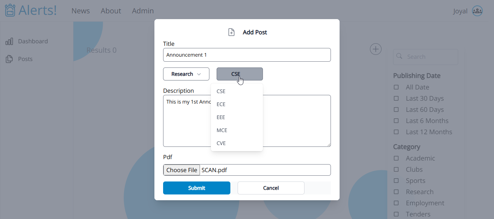

# Winter_Project_Challenge_2023-2024
A NextJS project for the challenge : Announcement Website

# Technologies
```
1.) Nextjs 
2.) Postgres as Database
3.) Prisma as ORM
``` 


# Setup
```
1.) Run Postgres on default port 5432
2.) run on cmd in project folder : npx prisma migrate dev --name init; 
3.) run on cmd in project folder : npm i; npm run build; npm run start;

```

This will setup a developement server on port 3000

# Endpoints
1.) */news*
This endpoint will show a webpage that shows all announcements. This page will also has a search bar and filters.


2.) */admin/posts*
Here the authenticated users will be able to post, edit and delete announcements.



3.) */admin/dashbard*
Here the authenticated users will be able view total number of posts and documents uploaded.

