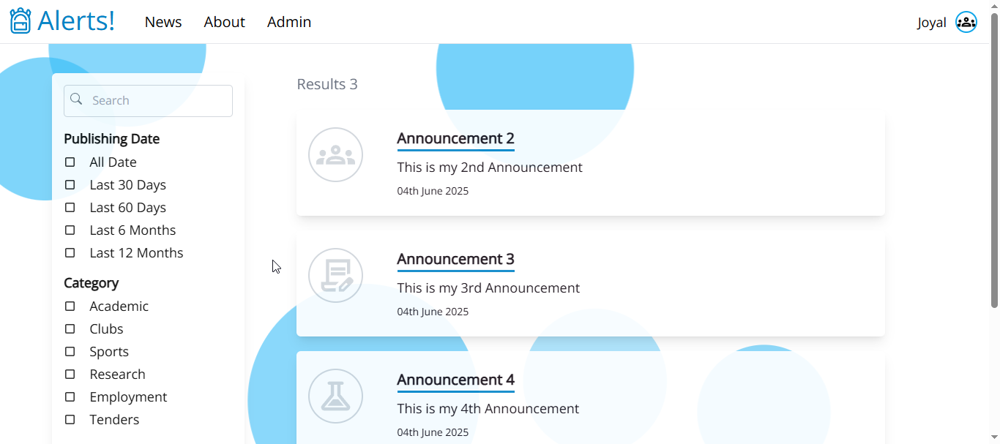
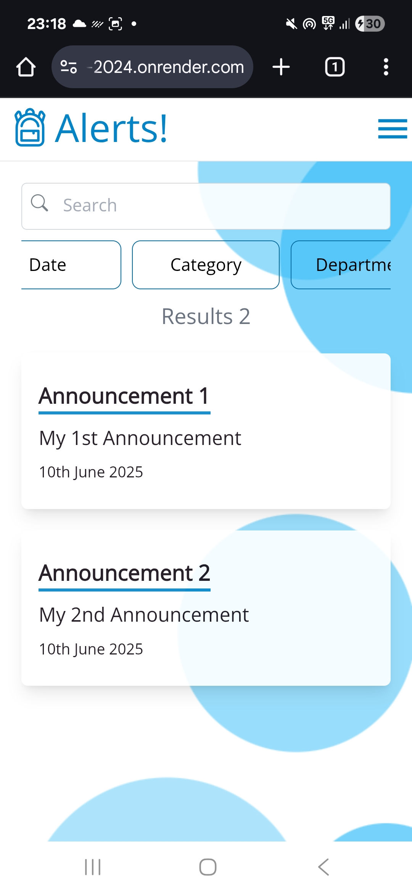
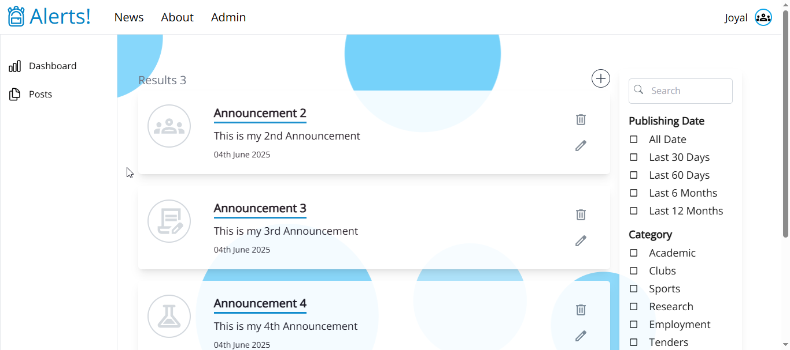
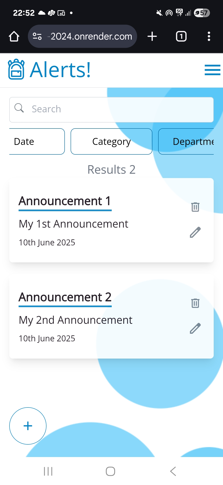
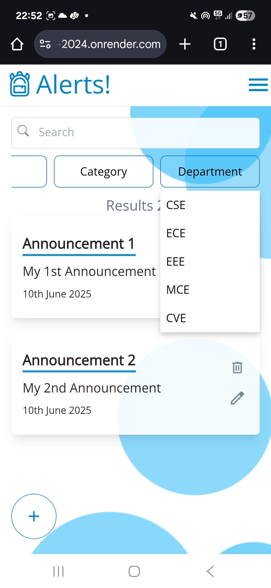
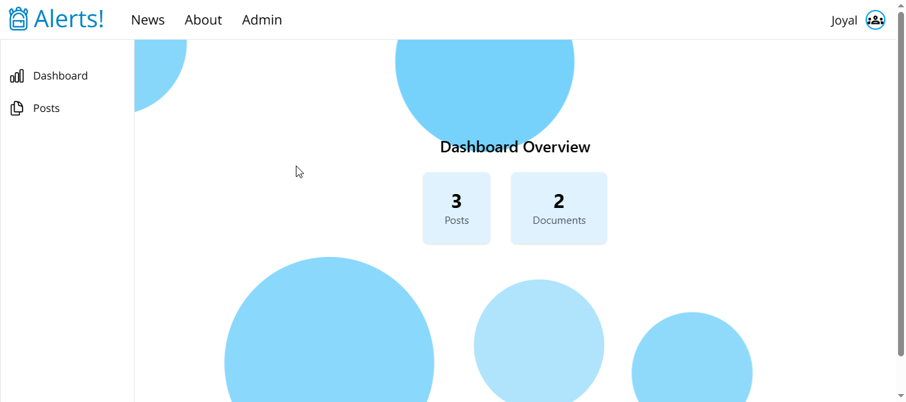
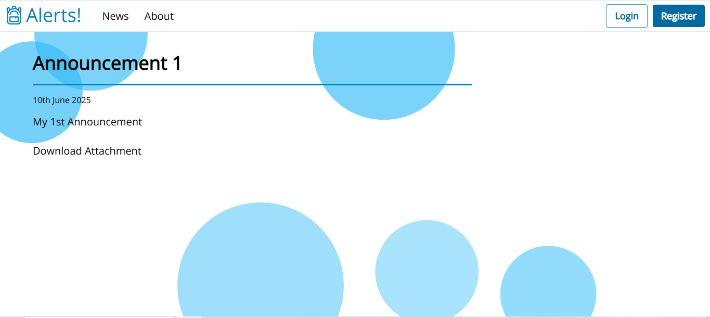
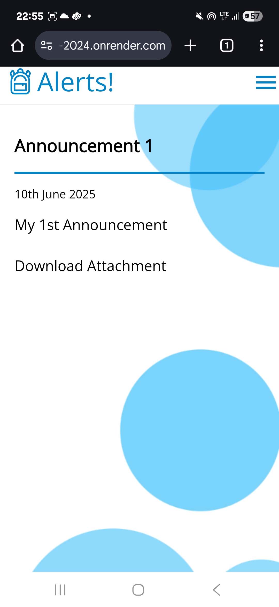
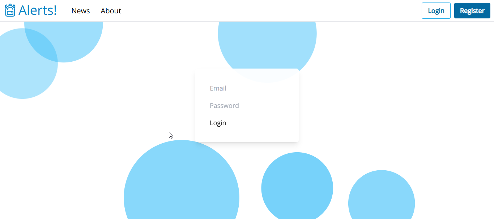
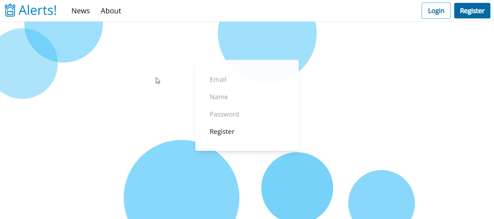

# Winter_Project_Challenge_2023-2024
This is a website that can display and manage announcements ( All CRUD operationas are implemented ) made by a college. It creates dynamic webpages for each announcement created.  

## Technologies
```
1.) Nextjs 
2.) Postgres as Database
3.) Prisma as ORM
``` 


## Setup
```
1.) Create a .env in same folder as project and give DATABASE_URL="<your urll>"
2.) To Initialize Prisma use these commands on the project folder: 
        > npx prisma migrate dev --name init
        > npx prisma generate
        > npx prisma migrate deploy
3.) To Deploy the project use these commands: 
        > npm i
        > npm run build
        > npm run start

```

## Endpoints
1.) */news* <br/>
Here the users will be able to view all existing announcements<br/><br/>
<br/>
Mobile View<br/>
<br/>

2.) */admin/posts*
Here the authenticated users will be able to post, edit and delete announcements.<br/>
<br/>
Mobile View<br/>
 <br/>
<br/>

3.) */admin/dashbard*
Here the authenticated users will be able view total number of posts and documents uploaded.<br/>
<br/>

4.) */news/[id]*
Dynamic route that returns a dynamically created page for each announcment.<br/>
<br/>
Mobile View<br/>
<br/>

4.) */login*
Here users can login to the site.<br/>
<br/>

5.) */register*
Here users can register onto the site.<br/>
<br/>